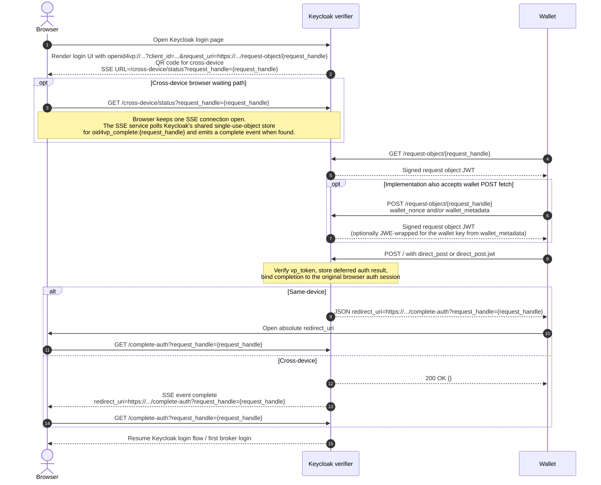
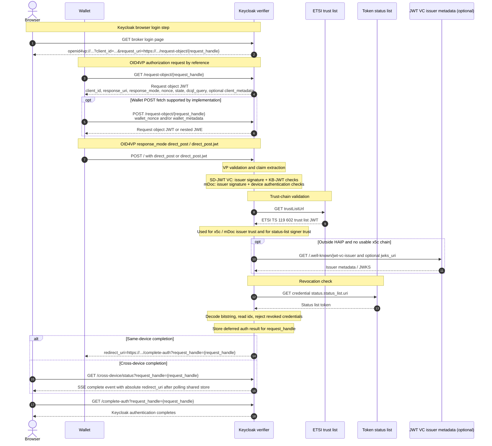

# OID4VP Diagrams

These diagrams summarize the browser, wallet, and Keycloak verifier flow at two levels:

- a high-level interaction view for same-device and cross-device login
- a lower-level protocol view showing where OID4VP, trust-list validation, and status-list checks fit

## High-Level Interaction

## Protocol Mapping

For the full walkthrough, request/state lifecycle, and class-level responsibilities, see [Request Flow Walkthrough](request-flow.md).
